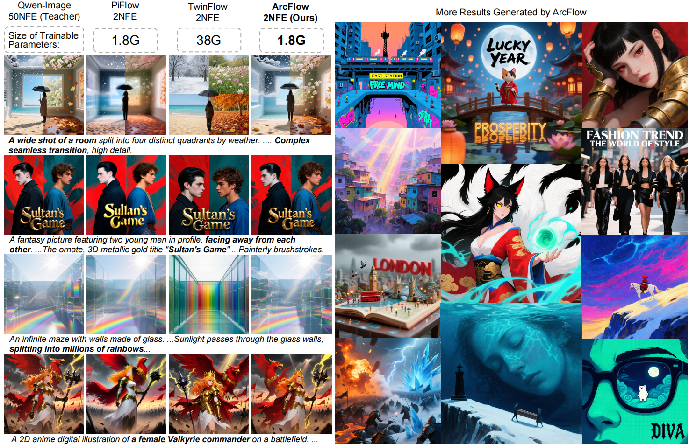

# ArcFlow
<a href='https://arxiv.org/abs/2602.09014'></a> <a href='https://huggingface.co/ymyy307/ArcFlow/tree/main'></a>  

ArcFlow: Unleashing 2-Step Text-to-Image Generation via High-Precision Non-Linear Flow Distillation
<br/>
Zihan Yang<sup>1</sup>, 
[Shuyuan Tu](https://github.com/Francis-Rings)<sup>1</sup>, 
Licheng Zhang<sup>1</sup>, 
[Qi Dai](https://scholar.google.com/citations?hl=en&user=NSJY12IAAAAJ)<sup>2</sup>, 
[Yu-Gang Jiang](https://scholar.google.com/citations?hl=en&user=f3_FP8AAAAAJ)<sup>1</sup>, 
[Zuxuan Wu](https://zxwu.azurewebsites.net/)<sup>1</sup>
<br/>
[<sup>1</sup>Fudan University; <sup>2</sup>Microsoft Research Asia]



## Overview

<p align="center">
  
  </br>
  <i>The overview of the distillation framework of ArcFlow.</i>
</p>

Diffusion models have achieved remarkable generation quality, but they suffer from significant inference cost due to their reliance on multiple sequential denoising steps, motivating recent efforts to distill this inference process into a few-step regime. However, existing distillation methods typically approximate the teacher trajectory by using linear shortcuts, which makes it difficult to match its constantly changing tangent directions as velocities evolve across timesteps, thereby leading to quality degradation. 
To address this limitation, we propose ArcFlow, a few-step distillation framework that explicitly employs non-linear flow trajectories to approximate pre-trained teacher trajectories. 
Concretely, ArcFlow parameterizes the velocity field underlying the inference trajectory as a mixture of continuous momentum processes. This enables ArcFlow to capture velocity evolution and extrapolate coherent velocities to form a continuous non-linear trajectory within each denoising step. Importantly, this parameterization admits an analytical integration of this non-linear trajectory, which circumvents numerical discretization errors and results in high-precision approximation of the teacher trajectory.
To train this parameterization into a few-step generator, we implement ArcFlow via trajectory distillation on pre-trained teacher models using lightweight adapters. This strategy ensures fast, stable convergence while preserving generative diversity and quality. 
Built on large-scale models (Qwen-Image-20B and FLUX.1-dev), ArcFlow only fine-tunes on less than $5\%$ of original parameters and achieves a $40 \times$ speedup with 2 NFEs over the original multi-step teachers without significant quality degradation. Experiments on benchmarks show the effectiveness of ArcFlow both qualitatively and quantitatively.

## News
* `[2026-2-9]`:🔥 The code, technical report and [the basic model checkpoints](https://huggingface.co/ymyy307/ArcFlow/tree/main) are released. 

## 🛠️ To-Do List
- [x] ArcFlow-Qwen-20B
- [x] ArcFlow-FLUX-12B
- [x] Inference Code
- [x] Training Code
- [ ] Multi-GPU Inference

## 🔑 Quickstart

ArcFlow supports high-quality text-to-image generation with only <b> 2 NFEs </b>. 

### Environment Setup

```
conda create -y -n arcflow python=3.10 ninja
conda activate arcflow

pip install torch==2.6.0 torchvision==0.21.0

pip install -r requirements.txt --no-build-isolation
```

### Inference 

We provide inference codes in [inference_qwen.py](inference_qwen.py) and [inference_flux.py](inference_flux.py). You can also easily modify the various configurations according to your needs. Note that the given checkpoint is trained with `timstep_ratio=1.0`, so we recommend keeping this config unchanged.

For single-GPU inference, simply run:
```
python inference_qwen.py
# or
python inference_flux.py
```

Note that our inference requires ~57GB for ArcFlow-Qwen and ~34GB for ArcFlow-FLUX. To reduce the GPU memory cost, replace the `pipe = pipe.to('cuda')` with `pipe.enable_model_cpu_offload()`, which reduces the inference of ArcFlow-Qwen to ~41GB and ArcFlow-FLUX to ~25GB. 

### Model Training

Follow the instructions in the following links to reproduce the main results in the paper:
- [Distilling Qwen-Image](configs/qwen/README.md)
- [Distilling FLUX](configs/flux/README.md)

By default, checkpoints will be saved into [checkpoints/](checkpoints/), logs will be saved into [work_dirs/](work_dirs/). These directories can be changed by modifying the config file.
If existing checkpoints are found, training will automatically resume from the latest checkpoint. The training logs can be plotted using Tensorboard. Run the following command to start Tensorboard:
```bash
tensorboard --logdir work_dirs/
```

To use Wandb logging, please export your authentication key to the `WANDB_API_KEY` environment variable, and then enable Wandb logging by appending the following code to the `hooks` list in the `log_config` part of the config file:
```python
dict(
    type='WandbLoggerHook',
    init_kwargs=dict(project='ArcFlow'),  # init_kwargs are passed to wandb.init()
)
```

To export a model checkpoint to diffusers safetensors for inference, run the following command after training:
```bash
python export_arcflow_to_diffusers.py <PATH_TO_CONFIG> --ckpt <PATH_TO_CKPT> --out-dir <OUTPUT_DIR>
```

### Acknowledgments
Thanks to [Qwen-Image](https://huggingface.co/Qwen/Qwen-Image), [FLUX](https://huggingface.co/black-forest-labs/FLUX.1-dev), [pi-Flow](https://github.com/Lakonik/piFlow), [TwinFlow](https://github.com/inclusionAI/TwinFlow), [Qwen-Image-Lightning](https://github.com/ModelTC/Qwen-Image-Lightning), [SenseFlow](https://github.com/XingtongGe/SenseFlow) for open-sourcing their models and code, which provided valuable references and support for this project. Their contributions to the open-source community are truly appreciated.

## Citation
```
@misc{yang2026arcflowunleashing2steptexttoimage,
      title={ArcFlow: Unleashing 2-Step Text-to-Image Generation via High-Precision Non-Linear Flow Distillation}, 
      author={Zihan Yang and Shuyuan Tu and Licheng Zhang and Qi Dai and Yu-Gang Jiang and Zuxuan Wu},
      year={2026},
      eprint={2602.09014},
      archivePrefix={arXiv},
      primaryClass={cs.CV},
      url={https://arxiv.org/abs/2602.09014}, 
}
```
